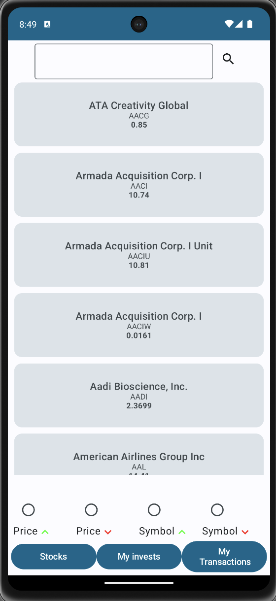
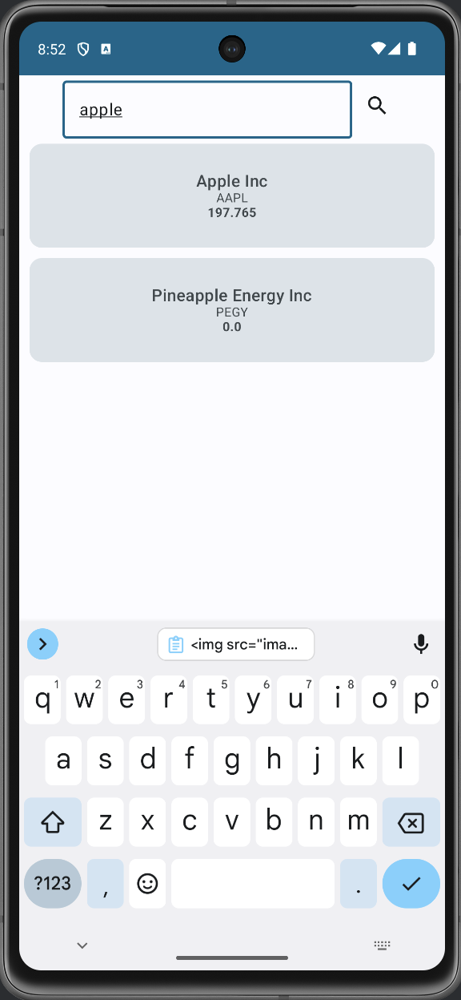
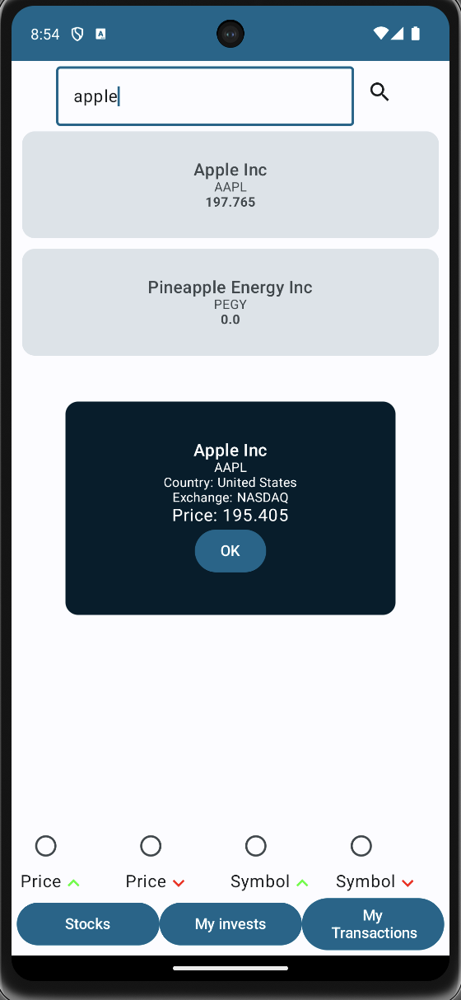
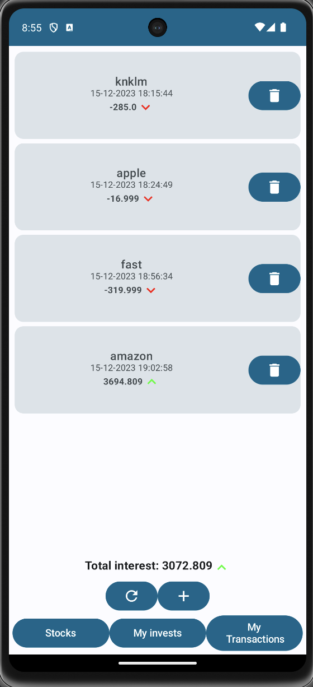
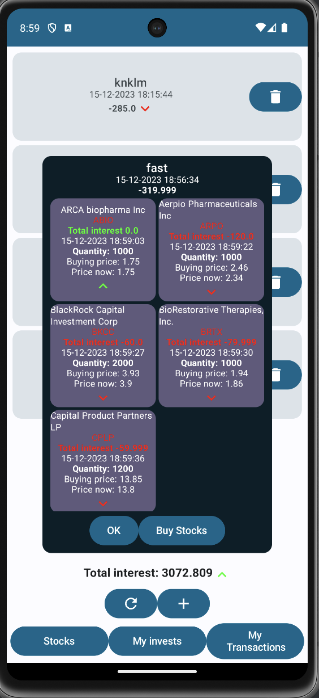
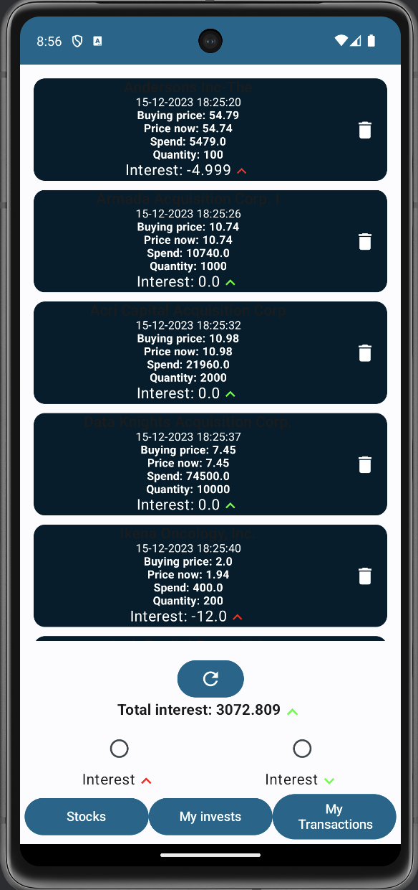
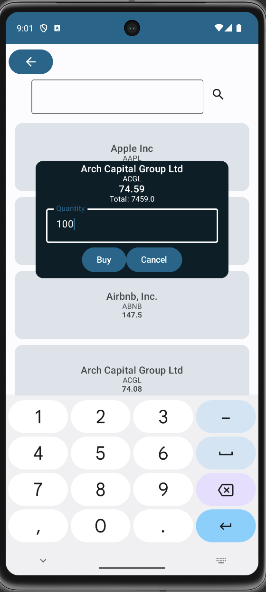

## Оглавление
1. Введение
2. Техническое задание
3. Архитектура системы
4. Описание реализации
5. Тестирование
6. Заключение
7. Список литературы
8. Приложения

---
## Giới thiệu

**Tên dự án**: Minvest  
**Nhóm**: P33202  
**Thành viên**: Đinh Trường Lãm  
**Mã số sinh viên**: 291186  
**Email**: dinhtruonglam001@gmail.com  
**Người hướng dẫn**: Ключев Аркадий Олегович  
**Tổ chức**: Đại học ITMO  
**Năm học**: 2023 - 2024  

**Tóm tắt**: Dự án Minvest là một dự án về đầu tư chứng khoán, cho phép người dùng sử dụng tiền ảo để mua cổ phiếu với giá thật, app sẽ cung cấp cho người dùng các thông tin về cổ phiếu, và cho phép người dùng tạo 1 khoản đầu tư chứa nhiều cổ phiếu khác nhau, và theo dõi lợi nhuận của khoản đầu tư đó. Giá của cổ phiếu lấy từ nguồn API của Rapid API - Twelve Data. Twelve Data là nguồn cung cấp API về giá cổ phiếu, cung cấp nhiều sàn chứng khoán như NASDAQ, CXA, NYSE, ... và nhiều loại tiền ảo như Bitcoin, Ethereum, ... Nhưng chủ yếu tập trung vào NASDAQ.

**Mục tiêu**: Tạo ra 1 app cho phép người dùng đầu tư cổ phiếu với tiền ảo, và theo dõi lợi nhuận của khoản đầu tư đó, để luyện tập cho đầu tư thực tế - nơi mà người dùng có thể mất tiền thật nếu đầu tư không hiệu quả, và cũng để tăng sự hiểu biết về đầu tư chứng khoán của người dùng.

## Điều khoản tham chiếu
### Yêu cầu chức năng
1. Tìm kiếm cổ phiếu theo tên
   Người dùng có thể search tên 1 mã cổ phiếu, hoặc tên gọi của công ty, và nhận được kết quả trả về là 1 danh sách các công ty có tên hoặc mã cổ phiếu chứa các ký tự vừa nhập vào.
   
2. Sắp xếp cổ phiếu theo giá, theo tên, giảm dần hoặc tăng dần
   Người dùng có thể sắp xếp cổ phiếu theo giá, theo tên, giảm dần hoặc tăng dần, để dễ dàng tìm kiếm cổ phiếu mình muốn mua
3. Sắp xếp lợi nhuận lịch sử các giao dịch
    Người dùng có thể sắp xếp lịch sử các giao dịch theo lợi nhuận, giảm dần hoặc tăng dần, để dễ dàng theo dõi lịch sử giao dịch của mình
4. Xem thông tin về cổ phiếu
   Bằng cách chạm vào 1 công ty cụ thể, người dùng có thể xem giá của cổ phiếu ngay hiện tại theo thời gian thực.
5. Tạo, xoá 1 khoản đầu tư
   Người dùng có thể tạo hoặc xoá 1 khoản đầu tư, nếu tạo, người dùng sẽ chọn các cổ phiếu mà mình muốn đầu tư vào, và số lượng cổ phiếu mà mình muốn mua. Số lượng cổ phiếu mua là không giới hạn, và người dùng có thể mua cổ phiếu với số lượng nhỏ nhất là 1 cổ phiếu.
6. Xoá 1 giao dịch
    Người dùng có thể xoá 1 giao dịch trong lịch sử giao dịch của mình, và số lượng cổ phiếu cũng sẽ xoá trong khoản đầu tư tương ứng.
7. Xem lợi nhuận của khoản đầu tư
   Người dùng có thể xem lợi nhuận của khoản đầu tư của mình, và xem lợi nhuận của từng cổ phiếu trong khoản đầu tư đó bất kỳ lúc nào, lợi nhuận được tính theo chênh lệch giá hiện tại của cổ phiếu và giá khi mua cổ phiếu đó, nhân với số lượng cổ phiếu đó. Và được cập nhật theo thời gian thực.
8. Xem lợi nhuận của giao dịch
    Người dùng có thể xem lợi nhuận của giao dịch của mình, lợi nhuận được tính theo chênh lệch giá hiện tại của cổ phiếu và giá khi mua cổ phiếu đó, nhân với số lượng cổ phiếu đó. Và được cập nhật theo thời gian thực.

### Bố cục giao diện

    <figure>
        
        <figcaption><i>Image 1</i></figcaption>
    </figure>
    <figure>
        
        <figcaption><i>Image 2</i></figcaption>
    </figure>
    <figure>
        
        <figcaption><i>Image 3</i></figcaption>
    </figure>
    <figure>
        
        <figcaption><i>Image 4</i></figcaption>
    </figure>
    <figure>
        
        <figcaption><i>Image 5</i></figcaption>
    </figure>
    <figure>
        
        <figcaption><i>Image 6</i></figcaption>
    </figure>
    <figure>
        
        <figcaption><i>Image 7</i></figcaption>
    </figure>

**Hình 1** Trang chính của ứng dụng
Người dùng sẽ được thấy danh sách các cổ phiếu và công ty tương ứng, ở đây, người dụng có thể sắp xếp theo tên, giá, hoặc tìm kiếm theo tên công ty hoặc mã cổ phiếu.

**Hình 2** Tìm kiếm cổ phiếu
Người dùng có thể tìm kiếm cổ phiếu theo tên công ty hoặc mã cổ phiếu, và sẽ nhận được danh sách các công ty có tên hoặc mã cổ phiếu chứa các ký tự vừa nhập vào.

**Hình 3** giá cổ phiếu
Sau khi người dùng chọn 1 công ty, người dùng sẽ được xem giá cổ phiếu của công ty đó theo thời gian thực.

**Hình 4** lịch sử các khoản đầu tư
Người dùng có thể xem lịch sử các khoản đầu tư của mình, và xem lợi nhuận của từng khoản đầu tư đó. Mũi tên màu xanh hướng lên thể hiện lợi nhuận tăng, mũi tên màu đỏ hướng xuống thể hiện lợi nhuận giảm. Người dùng có thể sắp xếp lịch sử các khoản đầu tư theo lợi nhuận, giảm dần hoặc tăng dần. Hoặc có thể xoá luôn khoản đầu tư, có nút refresh để cập nhật lại lợi nhuận của khoản đầu tư.

**Hình 5** chi tiết khoản đầu tư
Người dùng có thể xem chi tiết của 1 khoản đầu tư, và xem lợi nhuận của từng cổ phiếu trong khoản đầu tư đó bất kỳ lúc nào, lợi nhuận được tính theo chênh lệch giá hiện tại của cổ phiếu và giá khi mua cổ phiếu đó, nhân với số lượng cổ phiếu đó. Và được cập nhật theo thời gian thực.

**Hình 6** lịch sử các giao dịch
Người dùng có thể xem lịch sử các giao dịch của mình, và xem lợi nhuận của từng giao dịch đó. Mũi tên màu xanh hướng lên thể hiện lợi nhuận tăng, mũi tên màu đỏ hướng xuống thể hiện lợi nhuận giảm. Người dùng có thể sắp xếp lịch sử các giao dịch theo lợi nhuận, giảm dần hoặc tăng dần. Hoặc có thể xoá luôn giao dịch, có nút refresh để cập nhật lại lợi nhuận của giao dịch.

**Hình 7** Mua cổ phiếu
Người dùng chọn số lượng cổ phiếu muốn mua, nhỏ nhất là 1 cổ phiếu, tổng chi phí sẽ được hiển thị, và người dùng có thể mua cổ phiếu bằng cách chạm vào nút mua. Nếu người dùng đổi ý thì có thể chạm vào nút hủy để hủy giao dịch, hoặc có thể chạm vào bất kỳ đâu để đóng cửa sổ mua cổ phiếu.

**Bộ chọn màu**

| Name of Color | RGB           | Color Sample |
| ------------- | ------------- | ------------ |
| Green         | rgb(3, 255, 7)| 

 |
| Dark Blue     | rgb(0, 102, 139)| 

 |
| White         | rgb(252, 252, 255)| 

 |
| Light Grey    | rgb(220, 227, 233)| 

 |
| Red           | rgb(255, 0, 0)| 

 |

## Kiến trúc hệ thống
### Ngăn xếp công nghệ
Kotlin - ngôn ngữ lập trình chính
Android Studio - IDE
Retrofit - thư viện để gọi API
Room - thư viện để tương tác với cơ sở dữ liệu
Moshi - thư viện để chuyển đổi JSON sang object
Git - hệ thống quản lý phiên bản
Gradle - hệ thống quản lý phụ thuộc

### Các lớp của hệ thống
**Trải nghiệm người dùng và điều khiển**
1. Nhấp vào nút tìm kiếm
2. Nhấp vào nút sắp xếp, theo tên, lợi nhuận, giá, giảm dần hoặc tăng dần
3. Nhấp vào 1 công ty
4. Xem giá cổ phiếu của công ty đó
5. Xem danh mục các khoản đầu tư và dữ liệu của các khoản đầu tư đó
6. Xem lịch sử các giao dịch
7. Ấn vào nút tạo khoản đầu tư
8. Ấn vào nút mua cổ phiếu
9. Xoá 1 khoản đầu tư, xoá 1 giao dịch
   
**Tương tác với cơ sở dữ liệu**
1. Cập nhật dữ liệu về danh mục các khoản đầu tư, lịch sử các giao dịch, và lợi nhuận của các khoản đầu tư, lợi nhuận của các giao dịch
2. TÌm kiếm cổ phiếu theo tên công ty hoặc mã cổ phiếu, danh sách sẽ cập nhật ngay trong lúc người dùng nhập, không cần ấn nút enter hoặc nút tìm kiếm
3. Xoá 1 khoản đầu tư, xoá 1 giao dịch
4. Tạo 1 khoản đầu tư, mua cổ phiếu
**Quy trình kinh doanh**
### Yêu cầu bảo mật
### Cấu trúc cơ sở dữ liệu
**Mô tả tên miền**
**Inforlogical model**
**Data model**
### Thuật toán
**Thuật toán 1** 
**Thuật toán 2**
